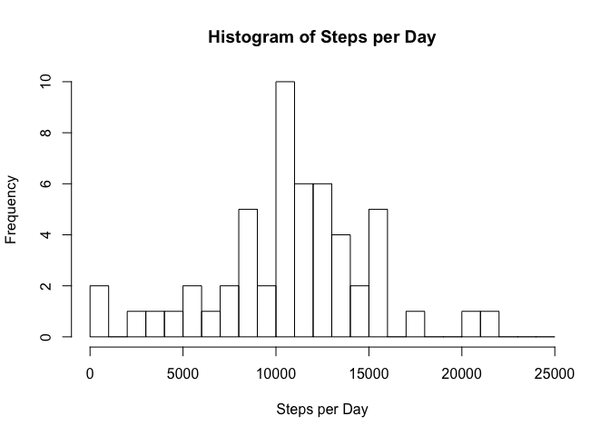
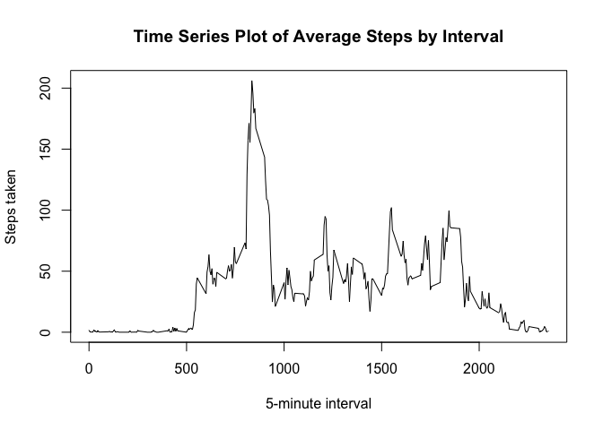
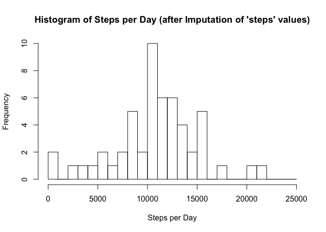
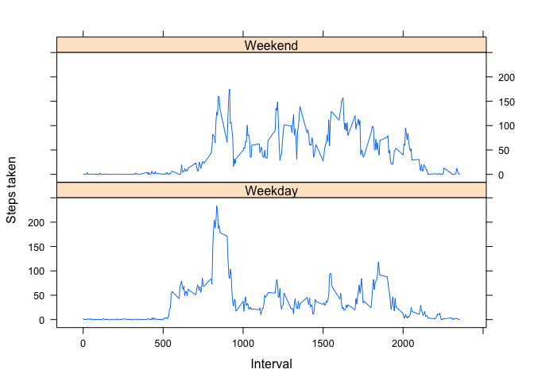

# Reproducible Research: Peer Assessment 1

The goal of this assignment is to produce a report that outlines the steps taken to analyze and answer questions pertaining to data from a personal activity monitoring device.

## Loading and preprocessing the data
The personal activity dataset is included in this repository as `activity.zip`, we'll need to unzip it, then load it for analysis.


```r
unzip("activity.zip")
df <- read.csv("activity.csv")
```
#### Quick Analysis
It's noted that our activity dataset may contain missing values, so let's take a quick peek at the data.


```r
str(df)
```

```
## 'data.frame':	17568 obs. of  3 variables:
##  $ steps   : int  NA NA NA NA NA NA NA NA NA NA ...
##  $ date    : Factor w/ 61 levels "2012-10-01","2012-10-02",..: 1 1 1 1 1 1 1 1 1 1 ...
##  $ interval: int  0 5 10 15 20 25 30 35 40 45 ...
```
From the summary it's clear we are missing values for `steps` (as noted in our assignment notes). Let's see if we're missing any values for `date` or `interval`.


```r
# give us count of rows without any missing "date" value
nrow(df[!is.na(df$date),])
# give us count of rows without any missing "interval" value
nrow(df[!is.na(df$interval),])
```

```
## [1] 17568
## [1] 17568
```
Great, no other missing variables for our data, let's move on to our main analysis.

## What is mean total number of steps taken per day?
In this part of our analysis, we'll perform the following:

1. calculate the number of steps taken per day
1. make a histogram of the total number of steps taken each day
1. and calculate and report the mean and median of the total number of steps taken per day

It was noted in our assignment that we'll need to "ignore the missing values" for this analysis. My interpretation of "ignore the missing values" is to completely omit any observations that have `NA`. 

```r
# from our earlier analysis, only "steps" was found to have any NA
complete_df <- df[!is.na(df$steps),]

# 1. calculate the number of steps taken per day
steps_per_day = aggregate(steps ~ date, data = complete_df, FUN = sum)

# 2. make a histogram of the total number of steps taken each day
hist(steps_per_day$steps, main="Histogram of Steps per Day",
     xlab="Steps per Day",
     # default breaks is not granular enough, lets change bins to 1k
     breaks=seq(0, 25000, 1000)) 
```

 

Finally our last analysis.

```r
# 3. calcular the mean and median of steps taken per day.
mean(steps_per_day$steps)
median(steps_per_day$steps)
```

```
## [1] 10766.19
## [1] 10765
```

## What is the average daily activity pattern?
In this analysis, we will perform the following:

1. make a time series plot of the interval and the average number of steps taken, averaged across all days
1. calculate which interval, contains the maximum number of steps

```r
# 1. plot of the interval and average steps taken, averaged across all days
steps_by_interval <- aggregate(steps ~ interval, data = complete_df, FUN = mean)
plot(steps_by_interval, type="l",
     main="Time Series Plot of Average Steps by Interval",
     xlab="5-minute interval",
     ylab="Steps taken")
```

 

```r
# 2. calculate which interval, contains the maximum number of steps
steps_by_interval$interval[which.max(steps_by_interval$steps)]
```

```
## [1] 835
```

## Imputing missing values
In this next analysis, we will to:

1. calculate and number of missing values in the dataset
1. devise a strategy for filling in all of the missing values
1. create a new dataset with imputed values
1. make histogram total number of steps taken each day, then calculate mean and median number of steps taken per day.
      a. do the values differ from the estimates from the first part of the assignment? 
      a. what is the impact of imputing missing data on the estimates of the total daily number of steps?


```r
# 1. calculate number of missing values, from our earlier 
# analysis we are only missing values in "steps"
nrow(df[is.na(df$steps),])
```

```
## [1] 2304
```

```r
# 2-3. we will use the mean of steps taken per day (from our previous analysis)
# as a replacement for values that need to be imputed
steps_per_day <- aggregate(steps ~ date, data=df, FUN=sum)
imputed_df <- merge(df, steps_per_day, by="date", suffixes=c("",".y"))
# list of indexes to impute
na_steps <- is.na(imputed_df$steps)
imputed_df$steps[na_steps] <- imputed_df$steps.y[na_steps]
imputed_df <- imputed_df[,1:3]
# build the steps by day with new imputed values
imputed_steps_by_day <- aggregate(steps ~ date, data=imputed_df, FUN=sum)


# 4. make histogram and ...
histinfo <- hist(imputed_steps_by_day$steps, 
                 main="Histogram of Steps per Day (after Imputation of 'steps' values)",
                 xlab="Steps per Day", 
                 # default breaks not granular enough, change bins to 1k
                 breaks=seq(0, 25000, 1000)) 
```

 

```r
# 4. create mean 
mean(imputed_steps_by_day$steps)
```

```
## [1] 10766.19
```

```r
# 4. and median steps taken per day
median(imputed_steps_by_day$steps)
```

```
## [1] 10765
```
_Do these values differ from the estimates from the first part of the assignment?_ **No they are the same**

_What is the impact of imputing missing data on the estimates of the total daily number of steps?_ **Not significantly**

## Are there differences in activity patterns between weekdays and weekends?
For our final analysis, we will need to do the following:

1. Create a new factor variable in the dataset with two levels – “weekday” and “weekend” indicating whether a given date is a weekday or weekend day.


```r
week_part_func <- function(date) {
   if(weekdays(as.Date(date)) %in% c("Saturday", "Sunday")) {
      return('Weekend')
   }
   return('Weekday')
}

imputed_df$week_part <- as.factor(sapply(imputed_df$date, week_part_func))
```

1. Make a panel plot containing a time series plot (i.e. type = "l") of the 5-minute interval (x-axis) and the average number of steps taken, averaged across all weekday days or weekend days (y-axis). See the README file in the GitHub repository to see an example of what this plot should look like using simulated data


```r
library(lattice)
library(reshape2)

melted_steps <- melt(imputed_df, measure.vars="steps")

mean_melted_steps <- dcast(melted_steps, week_part+interval~variable, mean)
xyplot(steps~interval|week_part, data = mean_melted_steps,
      type = 'l',
      xlab = 'Interval',
      ylab = 'Steps taken',
      layout = c(1,2))
```

 
